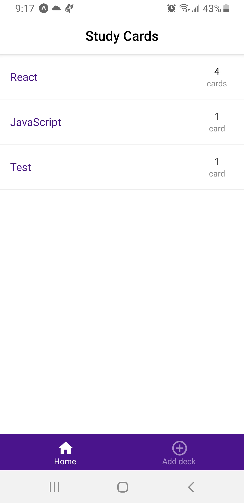

# Flashcards Application

This is a simple mobile app that allows users to study collections of flashcards. Users can create different categories of flashcards called "decks", add flashcards to those decks, then take quizzes.

## Setup

To get started:

* install all project dependencies with `npm install`
* start the development server with `npm start`

The app works in either Android or iOS emulators.

## Contributing

Pull requests are not accepted.

